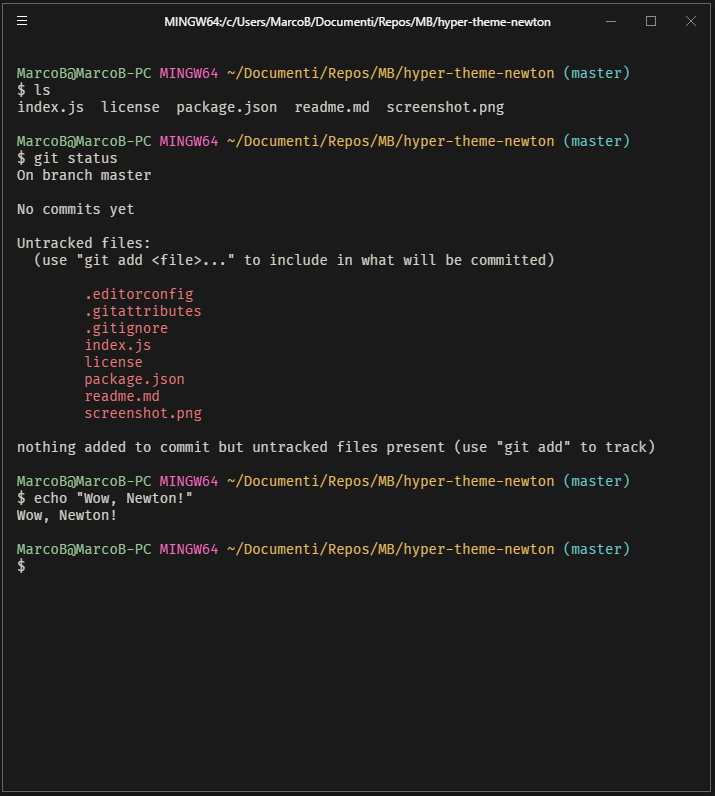

# Newton for Hyper.js

> A low eyestrain [Hyper](https://hyper.is) theme. Apple not included.

## Install

Add `hyper-theme-newton` to the plugins list in your `~/.hyper.js` config file and restart Hyper.

## License

MIT © [Marco Bertolini](http://www.marcobertolini.net)
